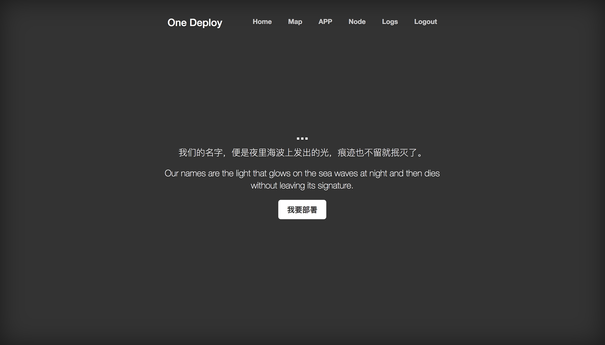
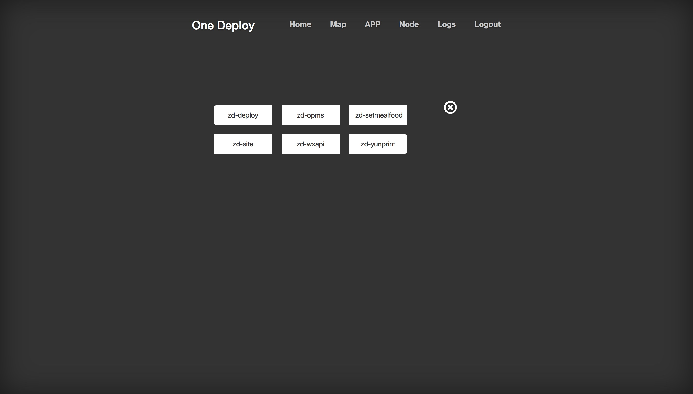
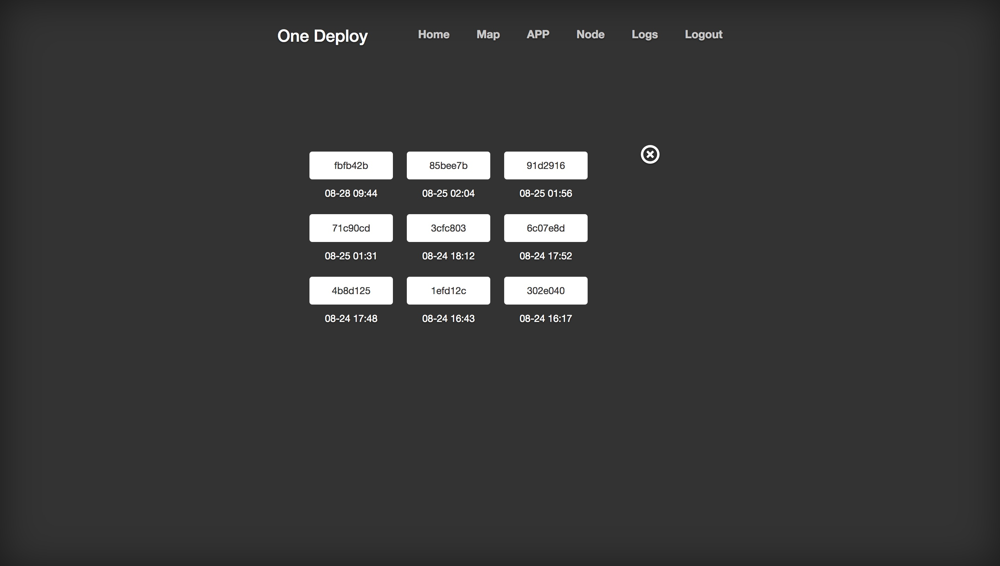

# Opt-Deploy 项目部署系统
```
系统用于项目部署，与Jenkins连用，Jenkins将项目打包且按版本号分开，
本系统则根据选择的项目名和对应的版本号，将应用包同步到部署机器，重启服务。
```
#### 项目部署

###### 1.修改properties中deploy.build_repo=/opt/jenkins/build为你的jenkins构建目录
###### 2.配置Jenkins中的项目配置，以ZD-Deploy项目为例，配置Post Steps的Execute shell

```
#!/bin/bash

service_name="zd-deploy"
file_name=${service_name}.jar

pro_commit=${GIT_COMMIT:1:7}

echo ${pro_commit}

pakge_name=`ls target/ | grep ${service_name}".*.jar$"`

echo ${pakge_name}

mkdir -p ${JENKINS_HOME}/build/${service_name}/${pro_commit}

cp  target/${pakge_name} ${JENKINS_HOME}/build/${service_name}/${pro_commit}/${file_name}
```
###### 3.配置机器间免登录

###### 4.运行项目如下







